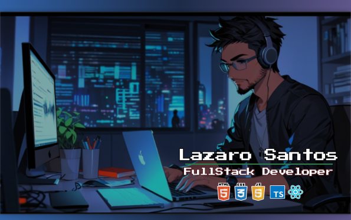

 
<h3 align="center" class="heading-element" dir="auto">•   FullStack Developer   •</h3>

 
    
  

<h3 align="center" class="heading-element" dir="auto">•   Sobre mim   •</h3>

Olá, sou Lazaro Santos, programador web e estudante de desenvolvimento mobile. Com uma paixão por criar experiências digitais interativas e funcionais, trabalho com tecnologias web como HTML, CSS, JavaScript, React e Node.js, enquanto estou expandindo meus conhecimentos para o mundo do desenvolvimento mobile.

 

<h3 align="center" class="heading-element" dir="auto">•  Tecnologias que utilizo  •</h3>

